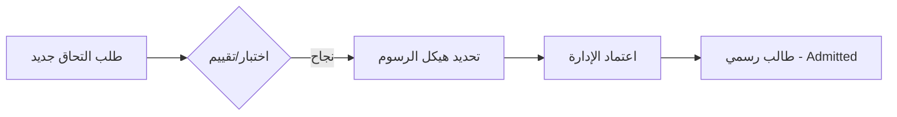
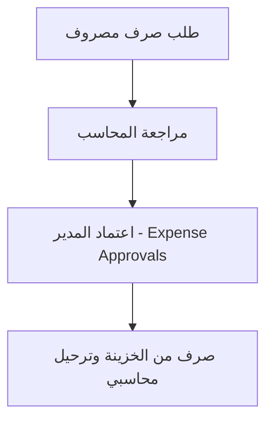

# Screen Reference Documentation Implementation Plan

> **For agentic workers:** REQUIRED SUB-SKILL: Use superpowers:subagent-driven-development (recommended) or superpowers:executing-plans to implement this plan task-by-task. Steps use checkbox (`- [ ]`) syntax for tracking.

**Goal:** Generate a comprehensive, professional reference guide for the School Management System across three target audiences: Management, Staff, and Developers.

**Architecture:** Markdown-based documentation structure ready for GitBook.
- **Management:** High-level Arabic workflows with Mermaid diagrams.
- **Users:** Step-by-step Arabic "How-To" guides.
- **Developers:** Technical English reference (Files, Stores, APIs).

**Tech Stack:** Markdown, Mermaid.js.

---

### Task 1: Information Mapping & Setup

**Files:**
- Create: `docs/superpowers/specs/screen_mapping.json`
- Create: `docs/superpowers/specs/documentation_content.md`

- [ ] **Step 1: Map all 23+ screens to technical details.**
Research every page in `src/pages/` and match with `stores/` and `Sidebar.tsx`.
- [ ] **Step 2: Initialize the documentation content file with headers.**

---

### Task 2: Management & Operations Section (Workflows)

**Files:**
- Modify: `docs/superpowers/specs/documentation_content.md`

- [ ] **Step 1: Write Executive Summary in Arabic.**
- [ ] **Step 2: Create Student Lifecycle Workflow (Mermaid).**

- [ ] **Step 3: Create Expense Approval Workflow (Mermaid).**

- [ ] **Step 4: Create Revenue Collection Workflow (Mermaid).**

---

### Task 3: User Guide Section (Arabic How-To)

**Files:**
- Modify: `docs/superpowers/specs/documentation_content.md`

- [ ] **Step 1: Write guide for "إدارة الطلاب" (List, Admission, Promotion).**
- [ ] **Step 2: Write guide for "المدفوعات والخزينة" and "المخزن".**
- [ ] **Step 3: Write guide for "المحاسبة والمصروفات" (Expenses, Approvals).**
- [ ] **Step 4: Write guide for "الإعدادات" (Fees, Discounts, Badges).**

---

### Task 4: Developer Reference Section (Technical English)

**Files:**
- Modify: `docs/superpowers/specs/documentation_content.md`

- [ ] **Step 1: Document Core Architecture (React, Zustand, Prisma).**
- [ ] **Step 2: Create Screen-to-Code mapping table for all pages.**
- [ ] **Step 3: Detail API/Store integration for major modules (Admission, Payments, Accounting).**

---

### Task 5: Final Review & Assembly

**Files:**
- Modify: `docs/superpowers/specs/documentation_content.md`

- [ ] **Step 1: Verify all Sidebar labels match documentation headers.**
- [ ] **Step 2: Run a spell check and formatting pass.**
- [ ] **Step 3: Present the final single Markdown file for GitBook copy-paste.**
