# خريطة UML الشاملة — نظام إدارة المدرسة

> **للعاملين بالنظام:** هذا المستند تحليلي بحت — يصف النظام كما هو بعيون المستخدم النهائي. لا يحتوي على كود تنفيذي.

**الهدف:** رسم خريطة UML كاملة للنظام تغطي جميع العمليات من منظور المستخدم النهائي، تُستخدم كمرجع لاتخاذ قرارات التطوير والتحسين.

**المنهجية:** التحليل من منظور المستخدم — "ماذا أريد أن أفعل؟" لا "كيف يعمل الكود؟"

---

## 1. مخطط حالات الاستخدام — Use Case Diagram

### الممثلون (Actors)

```
┌──────────────────────────────────────────────────────────────────┐
│                        ACTORS                                     │
├────────────────┬──────────────────────────────────────────────────┤
│ مدير النظام    │ صلاحيات كاملة — يرى كل شيء ويوافق على كل شيء  │
│ (Admin)        │                                                  │
├────────────────┼──────────────────────────────────────────────────┤
│ محاسب          │ يدير الحسابات، القيود، تقارير، يوافق مصروفات    │
│ (Accountant)   │                                                  │
├────────────────┼──────────────────────────────────────────────────┤
│ كاشير / خزينة  │ يفتح/يغلق الخزينة، يسجل مدفوعات، يستلم نقد    │
│ (Cashier)      │                                                  │
├────────────────┼──────────────────────────────────────────────────┤
│ موظف قبول      │ يضيف طلاب جدد، يتابع القبول، يدير الرسوم       │
│ (Admission)    │                                                  │
├────────────────┼──────────────────────────────────────────────────┤
│ موظف مستودع    │ يدير المواد، الشراء، التوزيع على الطلاب         │
│ (Inventory)    │                                                  │
└────────────────┴──────────────────────────────────────────────────┘
```

### حالات الاستخدام بالوحدات

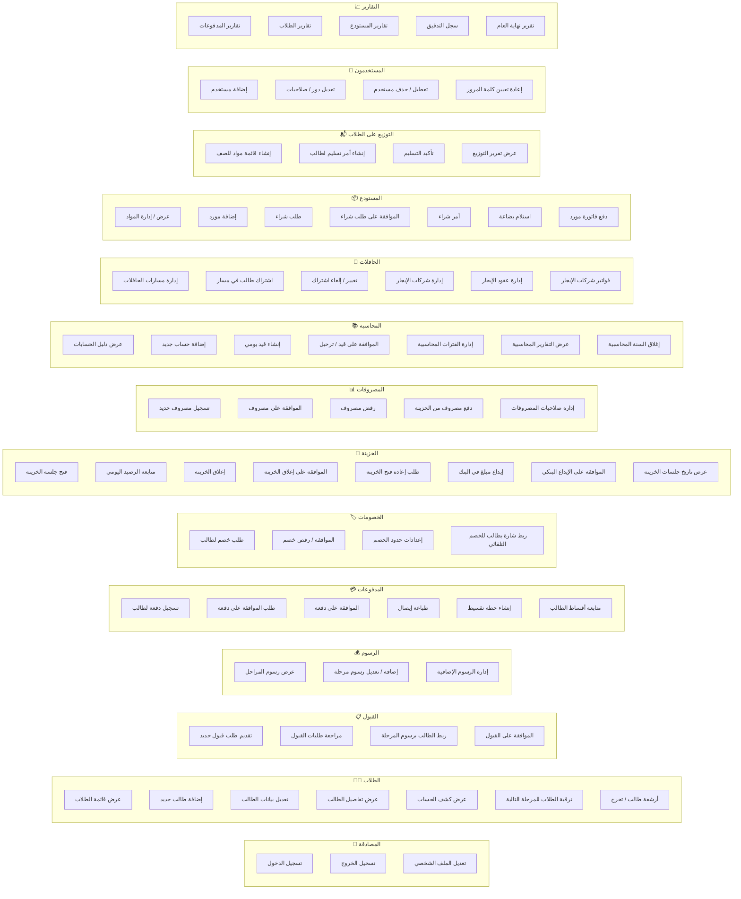

---

## 2. نموذج المجال — Domain Model (Class Diagram)

```mermaid
classDiagram
  direction TB

  class User {
    +id: UUID
    +name: String
    +email: String
    +role: String
    +active: Boolean
    +discountLimitPercent: Decimal
    +permissions: UserPermission[]
  }

  class Student {
    +id: UUID
    +nationalId: String
    +name: String
    +stage: String
    +grade: String
    +track: local|international
    +academicYear: String
    +status: StudentStatus
    +tuitionFees: Decimal
    +booksFees: Decimal
    +uniformFees: Decimal
    +busFees: Decimal
    +totalFees: Decimal
    +paidAmount: Decimal
    +discountAmount: Decimal
    +arrearsFees: Decimal
  }

  class StageFee {
    +stage: String
    +grade: String
    +track: String
    +academicYear: String
    +tuitionFees: Decimal
    +booksFees: Decimal
    +uniformFees: Decimal
    +applicationFees: Decimal
  }

  class Payment {
    +id: UUID
    +studentId: UUID
    +amount: Decimal
    +type: String
    +method: String
    +receiptNumber: String
    +date: DateTime
    +sessionId: UUID
  }

  class InstallmentPlan {
    +studentId: UUID
    +totalAmount: Decimal
    +academicYear: String
    +status: active|completed
    +installments: Installment[]
  }

  class Installment {
    +planId: UUID
    +amount: Decimal
    +dueDate: String
    +paidAmount: Decimal
    +status: pending|partial|paid
  }

  class Badge {
    +name: String
    +discountPercentage: Decimal
    +color: String
  }

  class TreasurySession {
    +date: String
    +openingBalance: Decimal
    +closingBalance: Decimal
    +actualBalance: Decimal
    +status: open|pending_close|closed
    +openedBy: String
    +closedBy: String
  }

  class BankDeposit {
    +amount: Decimal
    +bankAccountId: UUID
    +sessionId: UUID
    +status: pending|approved
  }

  class Expense {
    +amount: Decimal
    +description: String
    +accountId: UUID
    +paymentMethod: String
    +status: ExpenseStatus
    +requestedBy: String
    +approvedBy: String
    +sessionId: UUID
  }

  class Account {
    +code: String
    +name: String
    +type: asset|liability|equity|income|expense
    +parentId: UUID
    +normalBalance: debit|credit
    +isSystemAccount: Boolean
  }

  class JournalEntry {
    +entryNumber: String
    +entryDate: String
    +description: String
    +status: draft|approved|posted
    +lines: JournalEntryLine[]
  }

  class JournalEntryLine {
    +accountId: UUID
    +debit: Decimal
    +credit: Decimal
    +costCenterId: UUID
  }

  class FiscalYear {
    +yearCode: String
    +startDate: String
    +endDate: String
    +status: active|closed
    +periods: AccountingPeriod[]
  }

  class AccountingPeriod {
    +periodCode: String
    +fiscalYearId: UUID
    +status: open|closed
  }

  class BusRoute {
    +name: String
    +driverName: String
    +busNumber: String
    +capacity: Int
    +monthlyFee: Decimal
    +annualFee: Decimal
  }

  class BusSubscription {
    +studentId: UUID
    +routeId: UUID
    +academicYear: String
    +status: active|cancelled|suspended
    +actualAmount: Decimal
  }

  class RentalCompany {
    +name: String
    +contactPerson: String
    +isActive: Boolean
  }

  class RentalContract {
    +contractNumber: String
    +companyId: UUID
    +monthlyFeePerBus: Decimal
    +busesCount: Int
    +status: active|expired
  }

  class Supplier {
    +code: String
    +name: String
    +isActive: Boolean
  }

  class PurchaseRequest {
    +requestedBy: String
    +status: pending_approval|approved|rejected
    +items: PurchaseRequestItem[]
  }

  class PurchaseOrder {
    +supplierId: UUID
    +totalAmount: Decimal
    +status: issued|received|cancelled
  }

  class GoodsReceipt {
    +supplierId: UUID
    +orderId: UUID
    +receivedBy: String
  }

  class InventoryItem {
    +name: String
    +category: String
    +quantity: Int
    +unitPrice: Decimal
    +unitCost: Decimal
    +itemType: consumable|durable
  }

  class DeliveryOrder {
    +studentId: UUID
    +academicYear: String
    +term: String
    +status: pending|confirmed|delivered
    +chargeType: within_fees|extra_charge
    +totalAmount: Decimal
  }

  class GradeItemList {
    +stage: String
    +grade: String
    +academicYear: String
    +term: String
    +entries: GradeItemListEntry[]
  }

  class StudentYearlyFinance {
    +studentId: UUID
    +academicYear: String
    +totalFees: Decimal
    +paidAmount: Decimal
    +arrearsFees: Decimal
  }

  class AuditLog {
    +userId: UUID
    +action: String
    +entityType: String
    +before: JSON
    +after: JSON
  }

  %% Relations
  User "1" --> "*" Payment : يسجل
  User "1" --> "*" Expense : يطلب / يوافق
  Student "1" --> "*" Payment : له
  Student "1" --> "0..1" InstallmentPlan : له
  InstallmentPlan "1" --> "*" Installment : يحتوي
  Student "1" --> "0..1" Badge : يحمل
  Badge "1" --> "*" Student : ينطبق على
  Student "1" --> "*" BusSubscription : مشترك في
  BusRoute "1" --> "*" BusSubscription : يحتوي
  RentalCompany "1" --> "*" RentalContract : لديها
  RentalContract "1" --> "*" FleetBus : تشمل
  TreasurySession "1" --> "*" Payment : تسجل
  TreasurySession "1" --> "*" Expense : تدفع
  TreasurySession "1" --> "*" BankDeposit : تودع
  Account "1" --> "*" JournalEntryLine : يظهر في
  Account "1" --> "*" Expense : مرتبط بـ
  Account "0..1" --> "*" Account : أب لـ
  JournalEntry "1" --> "*" JournalEntryLine : يتكون من
  FiscalYear "1" --> "*" AccountingPeriod : يقسّم إلى
  AccountingPeriod "1" --> "*" JournalEntry : تحتوي
  Supplier "1" --> "*" PurchaseRequest : لديه
  Supplier "1" --> "*" PurchaseOrder : لديه
  PurchaseOrder "1" --> "*" GoodsReceipt : ينتج
  InventoryItem "1" --> "*" GradeItemListEntry : يظهر في
  GradeItemList "1" --> "*" GradeItemListEntry : تحتوي
  Student "1" --> "*" DeliveryOrder : له
  DeliveryOrder "1" --> "*" DeliveryOrderItem : يحتوي
  Student "1" --> "*" StudentYearlyFinance : له
```

---

## 3. مخطط حالات الطالب — Student Lifecycle State Diagram

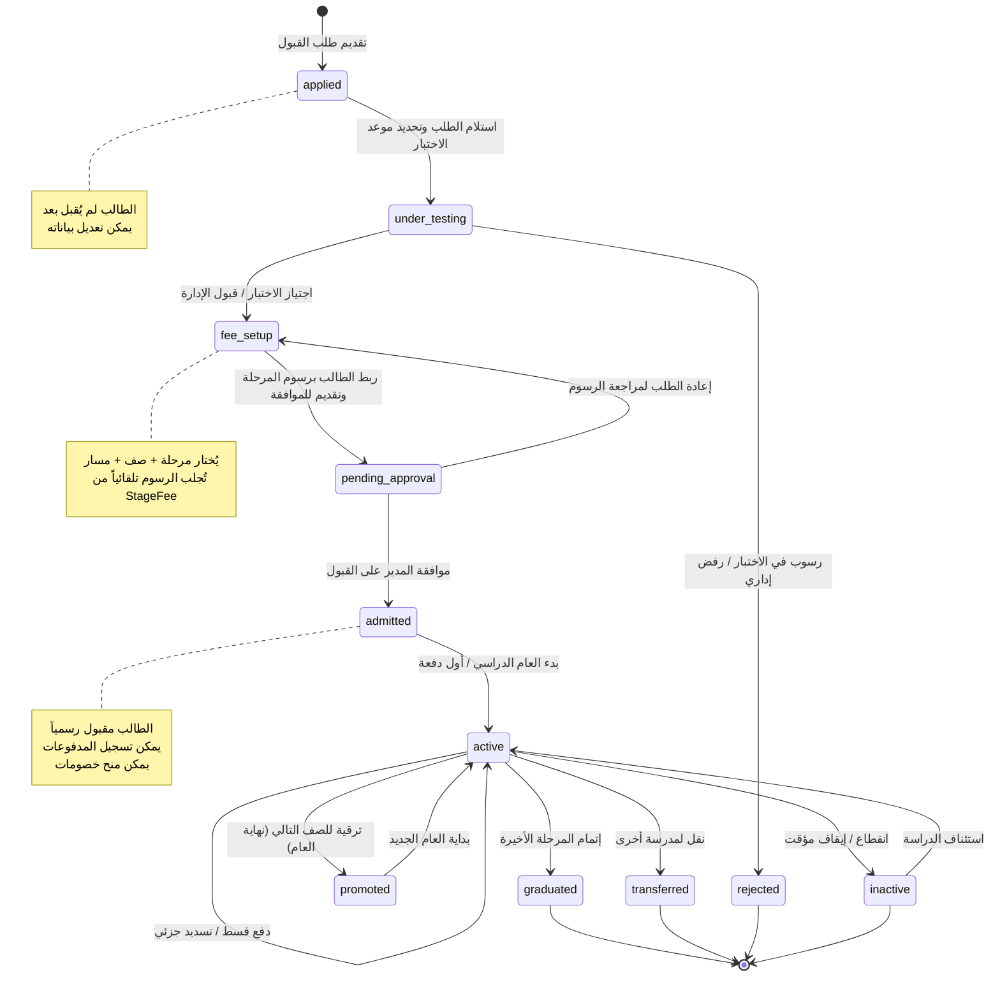

---

## 4. مخطط حالات جلسة الخزينة — Treasury Session State Diagram

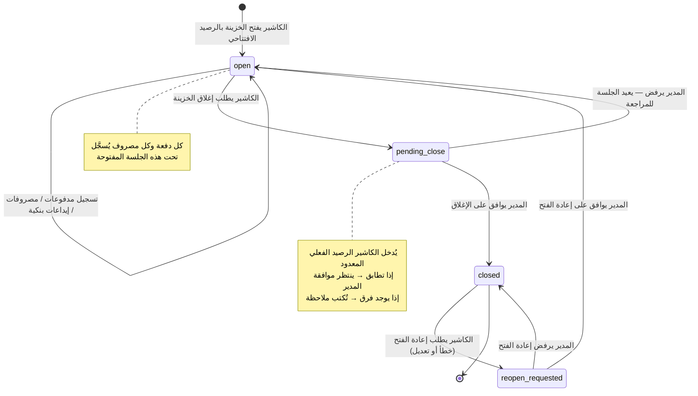

---

## 5. مخطط حالات المصروف — Expense Status State Diagram

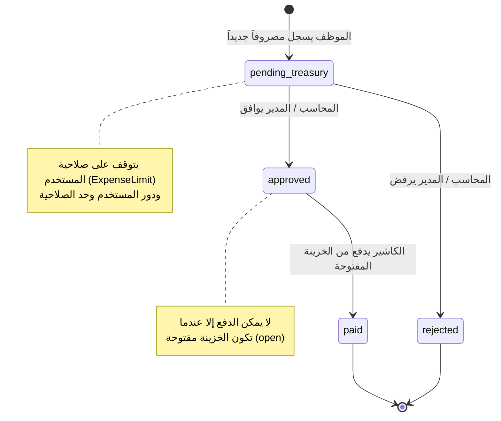

---

## 6. مخطط حالات الخصم — Discount Approval State Diagram

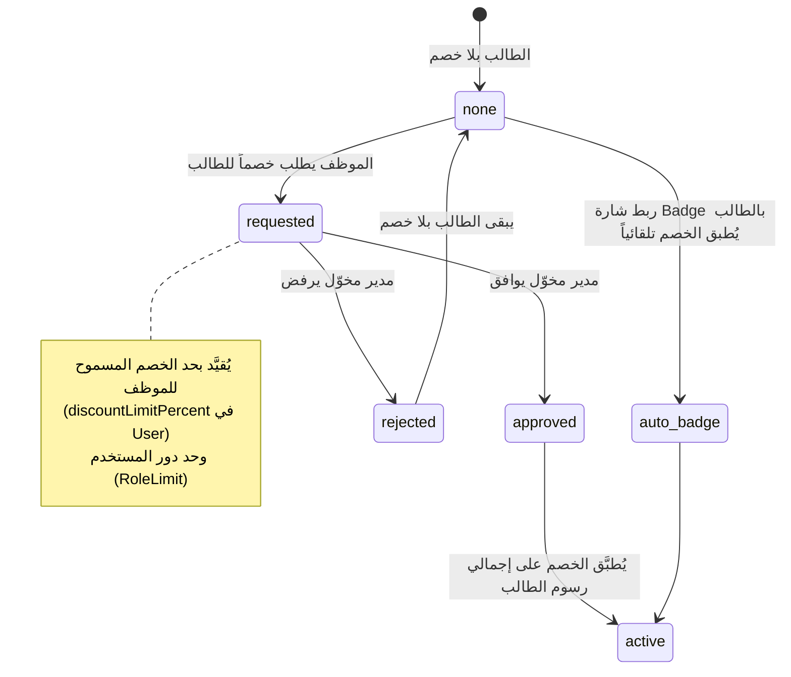

---

## 7. مخطط تسلسل رحلة القبول — Admission Sequence Diagram

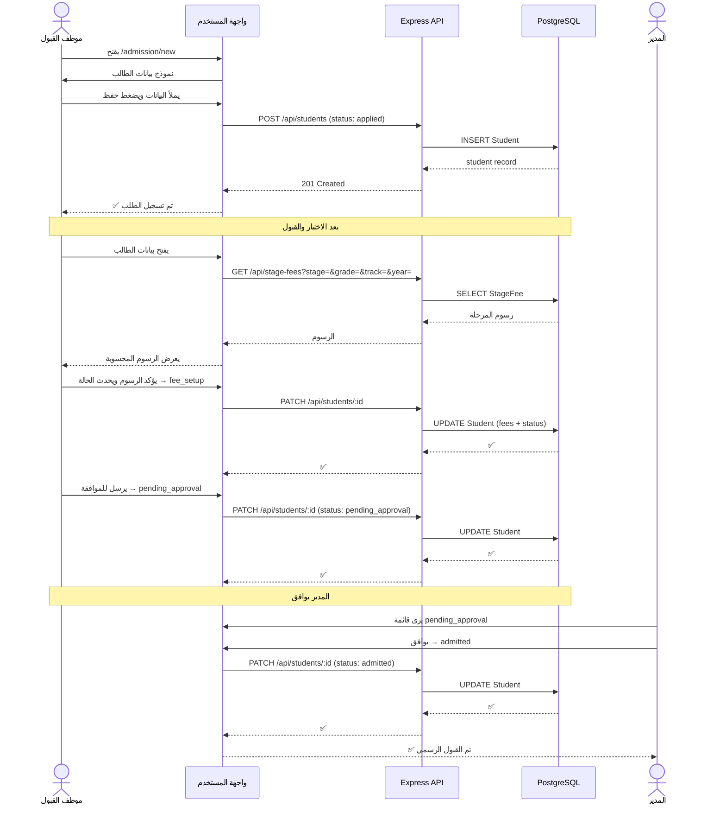

---

## 8. مخطط تسلسل تسجيل دفعة — Payment Sequence Diagram

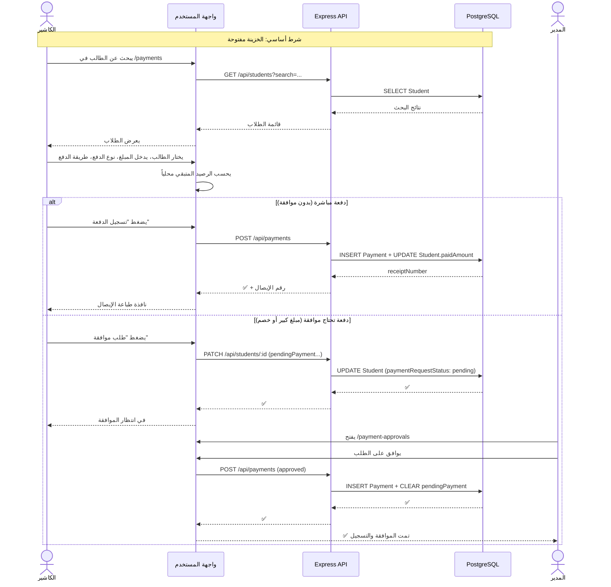

---

## 9. مخطط تسلسل عملية الشراء — Procurement Sequence Diagram

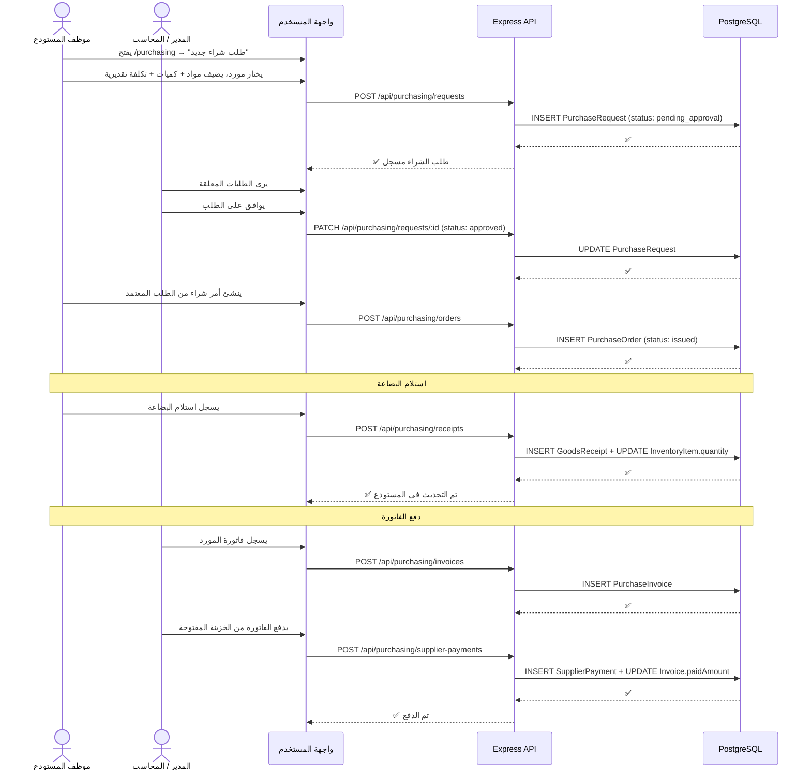

---

## 10. مخطط تسلسل توزيع المواد على الطلاب — Distribution Sequence Diagram

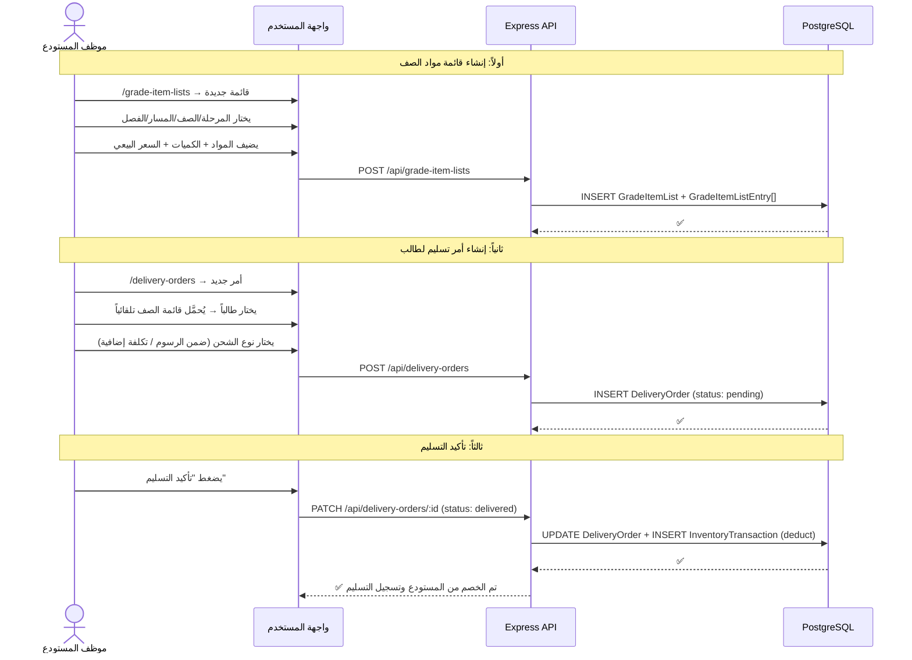

---

## 11. مخطط مكونات النظام — System Component Diagram

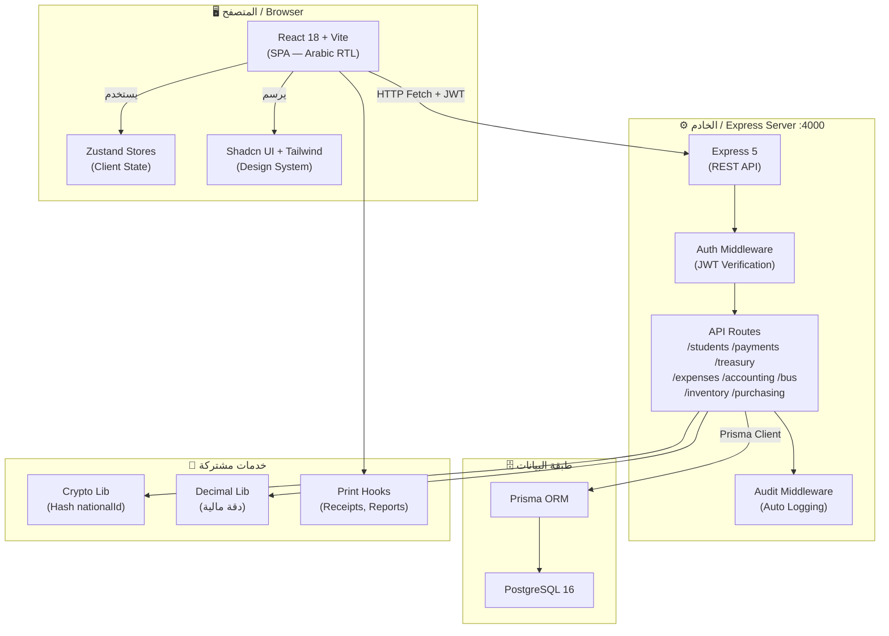

---

## 12. ملخص وحدات النظام — Module Summary

| الوحدة | الغرض | الحالة |
|--------|--------|--------|
| 🔐 المصادقة | JWT + دور المستخدم + صلاحيات دقيقة | ✅ مكتملة |
| 👨‍🎓 الطلاب | إدارة دورة حياة الطالب الكاملة | ✅ مكتملة |
| 📋 القبول | رحلة القبول من التقديم للقبول الرسمي | ✅ مكتملة |
| 💰 الرسوم | رسوم المراحل الدراسية متعددة المسارات | ✅ مكتملة |
| 💳 المدفوعات | تسجيل، موافقة، إيصالات، تقسيط | ✅ مكتملة |
| 🏷️ الخصومات | طلب، موافقة، شارات خصم تلقائية | ✅ مكتملة |
| 🏦 الخزينة | جلسات يومية، إغلاق، إيداع بنكي | ✅ مكتملة |
| 📊 المصروفات | طلب، موافقة، دفع من الخزينة | ⚠️ قيد التطوير |
| 📚 المحاسبة | دليل حسابات، قيود يومية، تقارير | ⚠️ قيد التطوير |
| 🚌 الحافلات | مسارات، اشتراكات، عقود إيجار | ✅ مكتملة |
| 📦 المستودع | مواد، شراء، موردون، استلام | ✅ مكتملة |
| 📬 التوزيع | قوائم الصفوف، أوامر تسليم الطلاب | ✅ مكتملة |
| 👥 المستخدمون | إدارة المستخدمين والصلاحيات | ✅ مكتملة |
| 📈 التقارير | تقارير مالية وإدارية | ⚠️ جزئية |
| 🛠️ الإدارة | قاعدة البيانات، هجرة، سجلات | ✅ مكتملة |

---

## 13. نقاط ضعف تظهر من رحلة المستخدم

> هذه ملاحظات من منظور المستخدم النهائي — ليست أخطاء في الكود بل فجوات في التجربة.

1. **الخزينة والمصروفات مترابطتان بقوة** — لا يمكن دفع مصروف بدون خزينة مفتوحة. لكن قد يحتاج المستخدم أن يرى المصروفات المعلقة حتى عند إغلاق الخزينة.

2. **تقارير الطلاب جزئية** — المستخدم يريد: "كم طالباً لم يسدد؟ ما إجمالي المتأخرات؟" — هذه التقارير غير واضحة المعالم.

3. **دليل الحسابات والقيود اليومية** — معظمها يدوي حتى الآن. المستخدم يتوقع أن تُنشأ قيود تلقائياً من كل عملية مالية (دفعة → قيد، مصروف → قيد).

4. **الشارة والخصم** — ربط الشارة يُطبق الخصم لكن لا تُحسب من الرسوم الحالية مباشرةً في بعض الحالات (انظر خطة `2026-05-26-badge-discount-not-deducted.md`).

5. **ترقية الطلاب** — عملية جماعية لكن تحتاج مراجعة لكل طالب على حدة قبل التأكيد.

---

*تاريخ الإنشاء: 2026-05-26 | بناءً على: تحليل الكود + تجربة المستخدم النهائي*
