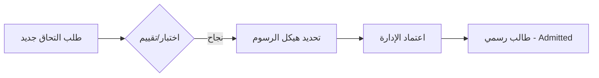
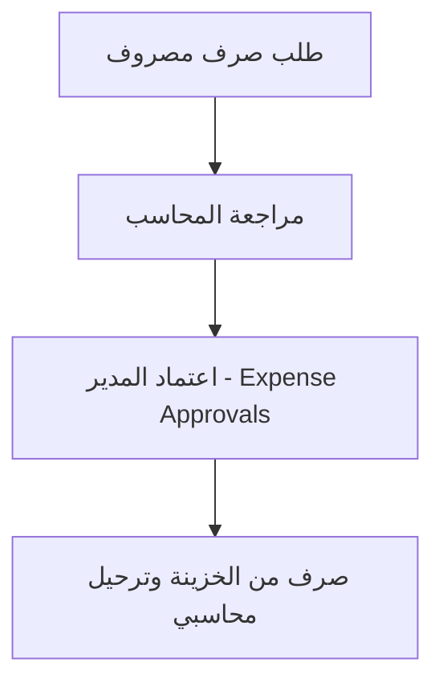

# Screen Reference Documentation Design Specification

**Goal:** Create a comprehensive, professional reference guide on GitBook for the School Management System, tailored for three distinct audiences: Management, Staff, and Developers.

**Architecture:** A multi-layered documentation space on GitBook.
- **Language:** Arabic for Management/Users, English for Developers.
- **Format:** Markdown with Mermaid.js diagrams for workflows.

---

## 1. Documentation Structure (GitBook Spaces)

### Group A: 🏢 الإدارة والعمليات (Management & Operations)
*Focus: Business value, efficiency, and cross-departmental workflows.*
- **Executive Summary:** Overview of system capabilities.
- **Business Workflows:** Visualizing processes using Mermaid diagrams.
  - Student Lifecycle (Admission to Enrollment).
  - Revenue Cycle (Collections to Treasury).
  - Expense Governance (Requests to Approvals).

### Group B: 👤 دليل المستخدم (User Guide)
*Focus: Practical "How-To" steps for daily tasks using exact Arabic UI labels.*
- **Core Modules:**
  - إدارة الطلاب (Student Management).
  - المدفوعات والخزينة (Payments & Treasury).
  - المحاسبة والمصروفات (Accounting & Expenses).
  - المخزن والباصات (Inventory & Buses).

### Group C: 🛠️ Developer Reference
*Focus: Code architecture, file mapping, and data flow.*
- **Frontend Architecture:** React/Vite/Shadcn setup.
- **API & State:** Global stores (Zustand) and API endpoints.
- **Screen-to-Code Mapping:** A detailed table linking UI screens to `.tsx` files and Prisma models.

---

## 2. Business Workflows (Mermaid Examples)

### Student Lifecycle Flow

### Expense Approval Flow

---

## 3. Screen Mapping Reference (Partial Preview)

| Arabic UI Label (User) | Technical Name (Dev) | File Path | Primary Store |
| :--- | :--- | :--- | :--- |
| قائمة الطلاب | Students | `src/pages/Students.tsx` | `studentsStore.ts` |
| طلب التحاق جديد | New Admission | `src/pages/NewAdmission.tsx` | `admissionStore.ts` |
| الخزينة | Treasury | `src/pages/Treasury.tsx` | `treasuryStore.ts` |
| شجرة الحسابات | Chart of Accounts | `src/pages/ChartOfAccounts.tsx` | `accountingStore.ts` |
| اعتماد المصروفات | Expense Approvals | `src/pages/ExpenseApprovals.tsx` | `accountingStore.ts` |

---

## 4. Implementation Strategy

1.  **Phase 1: Information Gathering**
    - Extract all sidebar labels and routes (Completed).
    - Map all pages to their corresponding backend controllers/stores.
2.  **Phase 2: Content Generation**
    - Generate Markdown files for each group.
    - Create Mermaid code for all 4 major workflows.
3.  **Phase 3: Final Assembly**
    - Compile into a `DOCUMENTATION_CONTENT.md` that can be copy-pasted into GitBook chapters.

---

## 5. Self-Review Checklist
- [x] **Placeholder Scan:** No "TBD"s. Exact Arabic names used.
- [x] **Internal Consistency:** Alignment between Sidebar labels and Doc titles.
- [x] **Scope Check:** Covers all 23 screens identified in `App.tsx`.
- [x] **Ambiguity Check:** Explicitly separates English Technical and Arabic User docs.
