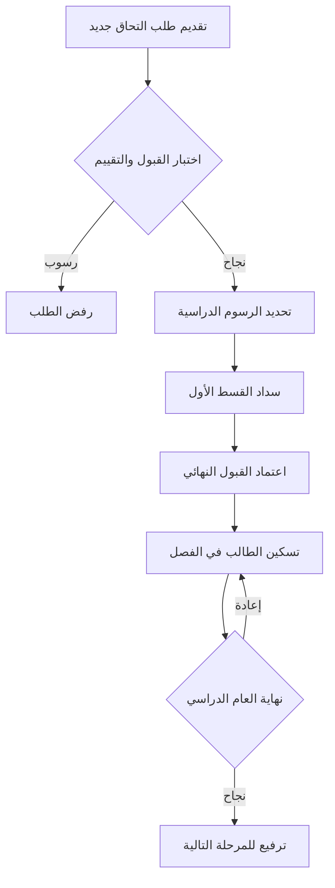
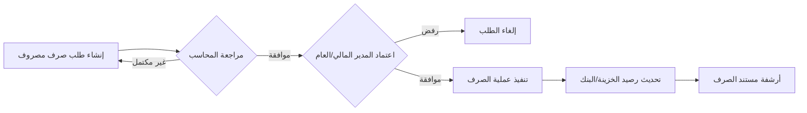
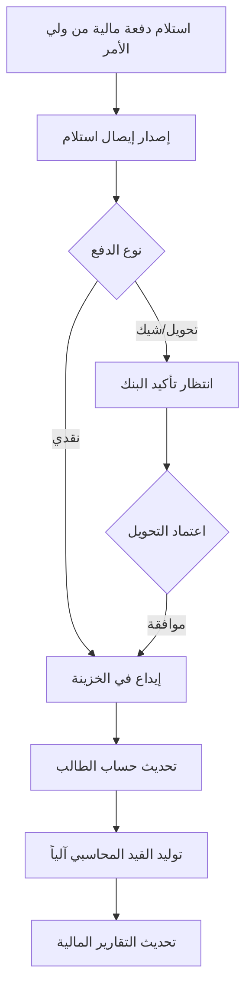

# School Management System Documentation

## 🏢 الإدارة والعمليات (Management & Operations)

### الملخص التنفيذي (Executive Summary)
يعتبر نظام إدارة المدرسة أداة استراتيجية متكاملة تهدف إلى رقمنة كافة العمليات الإدارية والمالية، مما يضمن دقة البيانات وسرعة اتخاذ القرار. يوفر النظام رؤية شاملة لأداء المؤسسة التعليمية من خلال تتبع دورة حياة الطالب، وإدارة التدفقات النقدية، وضمان الرقابة الصارمة على المصروفات والتحصيلات. يساهم النظام في تقليل الأخطاء البشرية، وتعزيز الشفافية بين الأقسام المختلفة (القبول، المالية، الإدارة العليا)، مما يرفع من كفاءة التشغيل ويحسن تجربة أولياء الأمور والطلاب.

### سير العمليات الأساسية (Core Workflows)

#### 1. دورة حياة الطالب (Student Lifecycle)
توضح هذه الدورة مراحل انتقال الطالب من مرحلة التقديم الأولي وصولاً إلى القبول النهائي والترفيع السنوي.

#### 2. دورة اعتماد المصروفات (Expense Approval Workflow)
تضمن هذه الدورة وجود رقابة مالية متعددة المستويات قبل صرف أي مبالغ من الخزينة.

#### 3. دورة التحصيل والإيرادات (Revenue Collection Workflow)
توضح كيفية معالجة المدفوعات الواردة وضمان تسجيلها في الدفاتر المحاسبية بدقة.

## 👤 دليل المستخدم (User Guide)
دليل تفصيلي يوضح كيفية استخدام كل شاشة في النظام، بدءاً من تسجيل الدخول والتعامل مع لوحة التحكم، وصولاً إلى إصدار التقارير وإدارة الحسابات المالية وصرف المصروفات.

### 1. إدارة الطلاب (Student Management)
يركز هذا القسم على كافة العمليات المتعلقة بالطلاب منذ التقديم وحتى التخرج أو الترفيع، مع رقابة صارمة على صحة البيانات.

#### طلب التحاق جديد (New Admission)
**الهدف والصلاحيات (Purpose & Roles):**
تسجيل بيانات الطلاب الجدد الراغبين في الالتحاق بالمدرسة ورفع المستندات الرسمية اللازمة. الشاشة متاحة لموظفي قسم القبول والتسجيل.

**شرح الحقول والقواعد (Fields & Business Rules):**
* **اسم الطالب رباعي:** نص إلزامي للتأكد من هوية الطالب في السجلات الرسمية.
* **الرقم القومي:** 14 رقماً. يتم التحقق من الصيغة واستنتاج تاريخ الميلاد آلياً (الرقم الأول يشير للقرن، والأرقام من 2-7 لتاريخ الميلاد).
* **تاريخ الميلاد:** حقل للقراءة فقط، يتم تعبئته تلقائياً بناءً على الرقم القومي لتقليل الأخطاء البشرية.
* **العام الدراسي:** اختيار من قائمة الأعوام المتاحة (الافتراضي هو العام الدراسي الحالي).
* **المرحلة والصف:** اختيار من قائمة المراحل (رياض أطفال، ابتدائي، إعدادي، ثانوي) والصفوف التابعة لها.
* **المسار:** (محلي/دولي) لتحديد المناهج والرسوم.
* **له إخوة بالمدرسة؟:** في حال اختيار 'نعم'، يظهر محرك بحث للبحث عن الإخوة بالاسم أو الرقم القومي لاستيراد بيانات ولي الأمر (الاسم، الهاتف) تلقائياً، مما يضمن توحيد السجلات.
* **اسم ولي الأمر وهاتفه:** هاتف ولي الأمر يجب أن يتكون من 11 رقماً ويبدأ بـ (010، 011، 012، 015).
* **المستندات:** رفع ملفات (صورة شخصية، شهادة ميلاد، بطاقة ولي أمر) بحد أقصى 5 ميجابايت للملف الواحد. يتم قبول صيغ الصور وPDF.

**العمليات الأساسية (Core Actions):**
* **البحث عن الإخوة:** تصفية قائمة الطلاب الحاليين لاستيراد بيانات ولي الأمر.
* **رفع الملفات:** تحويل الملفات المرفوعة إلى صيغة Base64 وتخزينها في سجل الطالب.
* **تسجيل الطلب:** استدعاء API `applyAdmission` لإضافة طلب الالتحاق وتحويله للمرحلة التالية (الخزينة).

**حالات استثنائية (Edge Cases):**
* **رقم قومي غير صالح:** يظهر خطأ في حال كان أقل من 14 رقماً أو يحتوي على تاريخ غير منطقي، ويمنع الحفظ.
* **تجاوز حجم الملف:** يمنع النظام رفع أي ملف يتجاوز 5 ميجابايت مع إظهار رسالة تنبيه فورية.

#### قائمة الطلاب (Students)
**الهدف والصلاحيات (Purpose & Roles):**
استعراض وإدارة كافة الطلاب المقيدين في المدرسة، مع إمكانية البحث والفلترة وتحديث البيانات الأساسية. متاحة لموظفي شؤون الطلاب والمحاسبين والإدارة.

**شرح الحقول والقواعد (Fields & Business Rules):**
* **إحصائيات سريعة:** تعرض إجمالي الطلاب، الطلاب النشطين، إجمالي المحصل المالي، والمستحقات المتأخرة.
* **تنبيهات الطلبات المرفوضة:** يظهر قسم خاص بالطلاب الذين تم رفض طلبات تحصيلهم من قبل الخزينة للمراجعة والتعديل.
* **جدول الطلاب:** يعرض الاسم، الشارة (إن وجدت)، الرقم القومي، المرحلة والصف، بيانات ولي الأمر، ونسبة التحصيل المالي.

**العمليات الأساسية (Core Actions):**
* **البحث والفلترة:** البحث بالاسم أو الرقم القومي أو هاتف ولي الأمر، والفلترة حسب المرحلة الدراسية.
* **تعديل البيانات:** نافذة منبثقة لتحديث البيانات الأساسية والحالة (نشط، غير نشط، متخرج، منقول).
* **حذف طالب:** حذف سجل الطالب نهائياً من النظام (يتطلب تأكيداً لضمان عدم الحذف بالخطأ).

#### تفاصيل الطالب (Student Detail)
**الهدف والصلاحيات (Purpose & Roles):**
ملف مالي وإداري شامل لكل طالب، يتيح تسجيل المدفوعات، إنشاء خطط الأقساط، وإصدار كشوف الحسابات. متاحة للمحاسبين ومدراء المدرسة.

**شرح الحقول والقواعد (Fields & Business Rules):**
* **الملخص المالي:** يعرض تفصيلياً (مصروفات دراسية، كتب، زي، باص، رسوم أخرى) مع إجمالي المطلوب والمدفوع والمتبقي.
* **تنبيه المتأخرات:** يظهر شريط تنبيه في حال وجود متأخرات من سنوات سابقة مع إمكانية تسديدها مباشرة.
* **الشارات (Badges):** إمكانية تعيين شارة للطالب تمنحه خصماً تلقائياً على الرسوم بنسبة محددة (مثل خصم أبناء الموظفين).

**العمليات الأساسية (Core Actions):**
* **تسجيل دفعة:** نافذة لتسديد مبلغ معين مع تحديد النوع (دراسة، باص، متأخرات) وطريقة الدفع (نقدي، تحويل، محفظة إلكترونية).
* **خطة الأقساط:** تقسيم المبلغ المتبقي على عدد محدد من الأقساط مع تحديد تواريخ الاستحقاق.
* **طباعة الإيصال:** توليد نسخة قابلة للطباعة من أي عملية دفع سابقة تحتوي على رمز الاستجابة السريعة (QR Code).
* **كشف حساب:** عرض تفصيلي لكافة الحركات المالية (استحقاقات ومدفوعات) خلال العام الدراسي.

**حالات استثنائية (Edge Cases):**
* **الدفع بالمحفظة:** يتطلب إدخال رقم الهاتف المحول منه لضمان مطابقة التحويل عند المراجعة.
* **متأخرات السنوات السابقة:** يتم توجيه أي مدفوعات جديدة لتغطية المتأخرات أولاً قبل رسوم السنة الحالية لضمان تحصيل المديونيات القديمة.

#### نقل الطلاب (Student Promotion)
**الهدف والصلاحيات (Purpose & Roles):**
ترحيل الطلاب من مرحلة دراسية إلى أخرى أو تخرجهم في نهاية العام الدراسي، مع تحديث الرسوم المالية آلياً. متاحة حصراً لمدير المدرسة ورئيس المحاسبين (school_director, head_accountant).

**شرح الحقول والقواعد (Fields & Business Rules):**
* **نقل فردي:** اختيار طالب محدد وتحديد وجهته الجديدة (المرحلة، الصف، العام الدراسي).
* **نقل جماعي:** اختيار مرحلة وصف بالكامل لنقلهم دفعة واحدة إلى الصف التالي (Bulk Promotion).
* **معادلة الرسوم:** يقوم النظام بمطابقة الطالب مع هيكل الرسوم (Stage Fee) الجديد بناءً على المرحلة والصف والمسار والعام الدراسي المختار.
* **المتأخرات (Arrears):** يتم ترحيل أي مبالغ غير مسددة من العام الحالي كـ 'متأخرات سنوات سابقة' تضاف لإجمالي المطلوب في العام الجديد.

**العمليات الأساسية (Core Actions):**
* **توليد المعاينة (Promotion Preview):** عرض تفاصيل الرسوم الجديدة (أساسية، خصم شارة، متأخرات) قبل اعتماد النقل للتأكد من صحة الحسابات.
* **إعادة تعيين التحصيل:** عند النقل، يتم تصفير خانة 'المبلغ المسدد' لتبدأ دورة تحصيل جديدة، مع الاحتفاظ بالمديونية القديمة كمتأخرات.

### 2. المدفوعات والخزينة (Payments & Treasury)
إدارة كافة التدفقات المالية الداخلة للنظام والرقابة على النقدية لضمان الشفافية والمسؤولية المالية.

#### المدفوعات والخزينة (Payments)
**الهدف والصلاحيات (Purpose & Roles):**
تعتبر هذه الشاشة المركز التنفيذي لكافة حركات النقدية الواردة (تحصيلات الطلاب) والصادرة (صرف المصروفات المعتمدة). الشاشة متاحة لموظفي الخزينة، ولكنها تخضع لرقابة صارمة حيث لا يسمح بإجراء أي عملية إلا للمستخدم الذي قام بفتح جلسة الخزينة الحالية بنفسه لضمان مسؤولية العهدة.

**شرح الحقول والقواعد (Fields & Business Rules):**
* **المقبوضات (تحصيل الطلاب):**
    * **قائمة الرسوم المعلقة:** تظهر آلياً الطلاب الذين لديهم طلبات تحصيل مرسلة من المحاسبين (رسوم دراسية، باص، الخ) أو طلاب جدد بانتظار سداد رسوم ملف التقديم.
    * **المبلغ والنوع:** يتم جلبهم آلياً من طلب التحصيل ولا يمكن تعديلهم في هذه الشاشة لضمان المطابقة المالية ومنع التلاعب.
    * **طريقة الدفع:** (نقدي، تحويل بنكي، محفظة إلكترونية) وتكون محددة مسبقاً في الطلب.
* **المصروفات (صرف معتمد):**
    * تظهر فقط المصروفات التي حصلت على كافة الاعتمادات الإدارية اللازمة ووصلت لحالة 'بانتظار صرف الخزينة'.

**العمليات الأساسية (Core Actions):**
* **تحصيل الآن:** فتح نافذة تأكيد استلام المبلغ من الطالب/ولي الأمر للتحقق النهائي.
* **تأكيد وصرف (للمصروفات):** إثبات خروج المبلغ من الخزينة فعلياً، تحديث حالة المصروف إلى 'تم الصرف'، وطباعة إذن صرف (Voucher) موقع.

**حالات استثنائية (Edge Cases):**
* **الخزينة مغلقة:** يظهر تنبيه مانع يمنع كافة العمليات المالية حتى يتم فتح جلسة عمل جديدة رسمياً.
* **مستخدم غير مفوض:** إذا حاول مستخدم (حتى لو كان مديراً) تسجيل دفعة في جلسة فتحها مستخدم آخر، يمنعه النظام لضمان مبدأ وحدة العهدة النقدية.

#### اعتمادات التحويلات (Payment Approvals)
**الهدف والصلاحيات (Purpose & Roles):**
شاشة رقابية مخصصة للإدارة العليا (مدير المدرسة أو المدير المالي) لمراجعة واعتماد المدفوعات التي لا تتم نقداً (التحويلات البنكية والمحافظ الإلكترونية) وكذلك اعتماد التعديلات الحساسة على خطط الأقساط.

**العمليات الأساسية (Core Actions):**
* **اعتماد الرصيد:** الموافقة النهائية على صحة التحويل، مما يؤدي لتوليد إيصال رسمي وتحديث حساب الطالب وتأكيد الدفعة فوراً.
* **رفض التحويل:** إعادة الطلب للمحاسب مع إشعار بالرفض (مع ذكر السبب) لتصحيح البيانات.

#### الخزينة (Treasury)
**الهدف والصلاحيات (Purpose & Roles):**
إدارة دورة حياة العهدة النقدية اليومية بالكامل. متاحة لأمناء الخزينة والمديرين الماليين لمتابعة السيولة اللحظية وإجراء عمليات الجرد والإغلاق والرقابة على العجز والزيادة.

**شرح الحقول والقواعد (Fields & Business Rules):**
* **فتح الخزينة:** يتطلب إدخال 'الرصيد الافتتاحي'. يقترح النظام رصيد الإغلاق السابق تلقائياً للحفاظ على تتابع الأرصدة.
* **الجلسة النشطة:** تعرض إحصائيات حية لـ (الرصيد الافتتاحي + إجمالي المقبوضات - إجمالي المصروفات) ليعطي 'الرصيد الحالي المتوقع' في الصندوق.
* **الجرد والإغلاق:** تتطلب إدخال 'المبلغ الفعلي' الموجود في الصندوق يدوياً بعد العد الفعلي للنقود.

**العمليات الأساسية (Core Actions):**
* **فتح الخزينة:** بدء جلسة عمل جديدة وتسجيل المستخدم المسؤول عن العهدة.
* **جرد وإغلاق:** إنهاء الجلسة. في حال وجود تطابق تام، يتم الإغلاق مباشرة وتجميد العمليات على هذه الجلسة.
* **الموافقة على الفرق:** في حال وجود عجز أو زيادة، يطالب النظام بكتابة 'سبب الفرق' (10 أحرف كحد أدنى) ليتم تسجيله في سجل التدقيق.

### 3. المحاسبة والمصروفات (Accounting & Expenses)
إدارة الدفاتر المحاسبية والمصروفات التشغيلية للمدرسة مع رقابة مالية دقيقة تضمن توازن القيود وسلامة الصرف.

#### شجرة الحسابات (Chart of Accounts)
**الهدف والصلاحيات (Purpose & Roles):**
إدارة الهيكل الهرمي لكافة الحسابات المالية للمدرسة. متاحة حصراً لرئيس الحسابات أو مدير النظام لضمان سلامة الهيكل المحاسبي وتوحيد التوجيه المالي.

**شرح الحقول والقواعد (Fields & Business Rules):**
* **نوع الحساب:** (أصول Asset، التزامات Liability، حقوق ملكية Equity، إيرادات Revenue، مصروفات Expense).
* **المستوى:** من 1 (رئيسي) إلى 4 (تفصيلي/تحليلي).
* **الرصيد الطبيعي:** تحديد ما إذا كان الحساب بطبيعته "مدين" (Debit) أو "دائن" (Credit).
* **حسابات النظام:** بعض الحسابات تكون معرفة مسبقاً (مثل حسابات العملاء والصندوق) ولا يمكن حذفها لضمان عمل العمليات الآلية في النظام.

**العمليات الأساسية (Core Actions):**
* **إضافة حساب جديد:** إنشاء حساب في مستوى محدد وربطه بحساب أب لضمان التسلسل الهرمي.

**حالات استثنائية (Edge Cases):**
* **الإدخال اليدوي:** يسمح النظام بالإدخال اليدوي (في شاشة القيود) فقط على الحسابات من المستوى الرابع (الحسابات التحليلية)، بينما الحسابات الرئيسية للقراءة فقط.

#### القيود المحاسبية (Journal Entries)
**الهدف والصلاحيات (Purpose & Roles):**
إنشاء وإدارة القيود المحاسبية اليدوية وتسجيل التسويات المالية في دفاتر المدرسة. متاحة للمحاسبين ومدراء الحسابات.

**شرح الحقول والقواعد (Fields & Business Rules):**
* **تاريخ القيد:** التاريخ المالي الذي سيتم تسجيل العملية فيه وتأثيره على التقارير.
* **سطور القيد (Lines):**
    * **قاعدة التوازن:** يجب أن يتساوى إجمالي مبالغ الطرف المدين مع إجمالي مبالغ الطرف الدائن تماماً ليقبل النظام حفظ القيد.
    * **الحد الأدنى للسطور:** يجب أن يحتوي القيد على سطرين على الأقل (طرف مدين وطرف دائن).

**العمليات الأساسية (Core Actions):**
* **اعتماد القيد:** نقل القيد من حالة "مسودة" إلى "معتمد" لمراجعته قبل التأثير النهائي.
* **ترحيل القيد:** التسجيل النهائي والقطعي للقيد في الدفاتر المحاسبية وتحديث أرصدة الحسابات فوراً.
* **عكس القيد:** إنشاء قيد عكسي تلقائياً لإلغاء تأثير قيد مرحل سابقاً، مع اشتراط إدخال سبب العكس للتدقيق.

#### طلب صرف مصروف (Expenses)
**الهدف والصلاحيات (Purpose & Roles):**
تسجيل وإدارة مدفوعات ونفقات المدرسة التشغيلية. تتيح هذه الشاشة للمحاسبين والموظفين المخولين تقديم طلبات صرف للبنود المختلفة (كهرباء، صيانة، إلخ).

**شرح الحقول والقواعد (Fields & Business Rules):**
* **المبلغ:** حقل رقمي إلزامي يحدد قيمة المصروف بدقة.
* **قاعدة الاعتماد التلقائي:** إذا كان المبلغ 1000 ج.م أو أقل، يتم تسجيل المصروف كـ "جاهز للصرف" مباشرة. إذا تجاوز هذا الحد، يتحول الطلب آلياً إلى حالة "بانتظار الاعتماد المالي".

#### اعتماد المصروفات (Expense Approvals)
**الهدف والصلاحيات (Purpose & Roles):**
مراجعة واعتماد طلبات الصرف التي تتجاوز صلاحية الموظف طالب الصرف. تقتصر هذه الشاشة على المدير المالي أو مدير المدرسة.

**العمليات الأساسية (Core Actions):**
* **اعتماد وصرف المبلغ:** الموافقة على الطلب وتحويل حالته إلى "جاهز للصرف" ليظهر تلقائياً في شاشة الخزينة للتنفيذ.
* **رفض الطلب:** تغيير حالة الطلب إلى "مرفوض" مع إخطار مقدم الطلب بسبب الرفض.

#### إدارة حدود الصرف (Expense Permissions)
**الهدف والصلاحيات (Purpose & Roles):**
ضبط الرقابة المالية من خلال تحديد سقف المبالغ التي يمكن لكل دور وظيفي صرفها مباشرة. متاحة حصراً للمديرين الماليين ومديري النظام.

### 4. المخزن والباصات (Inventory & Buses)
إدارة الموارد المادية والخدمات اللوجستية مع ربطها بالحالة المالية للطلاب لضمان تحصيل المستحقات والرقابة على المخزون.

#### المخزن (Inventory)
**الهدف والصلاحيات (Purpose & Roles):**
إدارة كافة الأصناف المادية (كتب، زي مدرسي، أدوات مكتبية) ومتابعة حركات الصرف والاستلام. متاحة لأمناء المخازن والمحاسبين لضمان الرقابة على عهدة المدرسة.

**شرح الحقول والقواعد (Fields & Business Rules):**
* **نوع الصنف:** (بيعي/استهلاكي). الأصناف البيعية (مثل الزي) تظهر في السجل المالي للطالب عند الصرف، بينما الاستهلاكية تخصم من المخزن فقط.
* **الحد الأدنى للطلب:** تنبيه يظهر آلياً عند وصول الكمية لرقم معين لضمان استمرارية التوريد.
* **قاعدة مديونية الطالب:** يمنع النظام صرف أي صنف "بيعي" لطالب لديه متأخرات مالية في الحسابات، ويظهر رسالة تطلب التوجه للمالية للتسوية أولاً.
* **تكلفة الوحدة وسعر البيع:** تتبع تكلفة الشراء لتقييم قيمة المخزن، وسعر البيع لتحديد القيمة المحصلة من الطالب.

**العمليات الأساسية (Core Actions):**
* **استلام بضاعة:** زيادة المخزون بناءً على فاتورة مورد مع إمكانية تحديث تكلفة الوحدة في سجلات المخزن.
* **صرف بضاعة:** إنقاص المخزون لصالح طالب (بيع) أو قسم (استهلاك) مع تسجيل الموظف القائم بالعملية.
* **إدارة التصنيفات:** تنظيم الأصناف في مجموعات (مثل: كتب لغات، زي رياضي) لتسهيل الجرد والبحث.

**حالات استثنائية (Edge Cases):**
* **نقص المخزون:** يظهر الصنف باللون الأحمر في الجدول مع أيقونة تنبيه "نقص" فور نزوله عن الحد المسموح.
* **صرف لطالب مدين:** يظهر تنبيه أحمر مانع يوضح قيمة المديونية المتبقية على الطالب ويمنع إتمام العملية لحين السداد.

#### الباصات (Bus Management)
**الهدف والصلاحيات (Purpose & Roles):**
تعريف خطوط السير وإدارة اشتراكات الطلاب وتوزيعهم على الحافلات بكفاءة. متاحة لمشرفي الباصات والمحاسبين.

**شرح الحقول والقواعد (Fields & Business Rules):**
* **سعة الباص:** الحد الأقصى للركاب. يمنع النظام إضافة مشتركين جدد في حال اكتمال السعة (Occupancy 100%).
* **نوع الاشتراك:** (شهري/سنوي). يحدد قيمة الرسوم التي سيتم تحميلها آلياً على حساب الطالب في السجل المالي.
* **محطات الخط:** قائمة بالمناطق التي يغطيها الخط لتسهيل مطابقة سكن الطالب مع الباص المناسب.

**العمليات الأساسية (Core Actions):**
* **تعريف خط:** إدخال بيانات السائق، رقم الباص، والرسوم المقررة (شهرية/سنوية).
* **تأكيد اشتراك:** ربط طالب بخط معين وتوليد "استحقاق مالي" فوراً في حسابه يظهر للمحاسبين.
* **إلغاء اشتراك:** إيقاف الخدمة عن الطالب وتحديث المقاعد المتاحة في الباص فوراً.

**حالات استثنائية (Edge Cases):**
* **تجاوز السعة:** يظهر شريط تقدم باللون الأحمر عند اقتراب الباص من كامل سعته لتنبيه المشرفين.
* **انتهاء الاشتراك:** تظهر قائمة بالاشتراكات التي أوشكت على الانتهاء للمحاسبين لمتابعة التحصيل.

### 5. الإعدادات والإدارة (Settings & Administration)
التحكم الكامل في قواعد عمل النظام، الهياكل المالية، وصلاحيات المستخدمين لضمان استقرار العمل.

#### لوحة التحكم (Dashboard)
**الهدف والصلاحيات (Purpose & Roles):**
عرض ملخص عام فوري لأداء المدرسة. متاحة لكافة الموظفين ولكن تختلف البيانات المعروضة حسب الصلاحيات.

**شرح الحقول والقواعد (Fields & Business Rules):**
* **إحصائيات حية:** (إجمالي الطلاب، إجمالي المحصل، مصروفات الشهر، عجز/زيادة الخزينة).
* **التنبيهات السريعة:** تظهر المصروفات والخصومات التي تنتظر اعتماد المدير فور تسجيل الدخول.

#### سجل الهياكل المالية (Stage Fee Management)
**الهدف والصلاحيات (Purpose & Roles):**
المرجع الأساسي لأسعار كافة الخدمات التعليمية لكل مرحلة وصف. متاحة لمدير المدرسة والمدير المالي حصراً.

**شرح الحقول والقواعد (Fields & Business Rules):**
* **العام الدراسي:** يتم ربط كل هيكل بعام محدد لتمكين النظام من إدارة الفترات المالية.
* **بنود الرسوم:** (تعليم، كتب، زي، باص، رسوم إضافية). يمكن إضافة بنود مخصصة لا نهائية لكل صف.
* **حماية البيانات التاريخية:** يمنع النظام تعديل أو حذف أي هيكل مالي ينتمي لسنوات دراسية سابقة لضمان سلامة الأرشيف المالي والتقارير المقارنة.

**العمليات الأساسية (Core Actions):**
* **بناء هيكل جديد:** تحديد أسعار السنة الدراسية القادمة لكل مرحلة وصف لتمكين القبول المبكر.
* **تعديل الهيكل:** متاح فقط للعام الدراسي الحالي قبل البدء في عمليات التحصيل المكثفة.

#### صلاحيات الخصم (Discount Settings)
**الهدف والصلاحيات (Purpose & Roles):**
تحديد "سقف" الخصم المسموح به لكل موظف بشكل فردي. متاحة حصراً لمدير النظام ومدير المدرسة.

**شرح الحقول والقواعد (Fields & Business Rules):**
* **نسبة الخصم المسموحة (%):** الحد الأقصى الذي يمكن للموظف منحه للطالب (مثلاً 5%).
* **الرقابة التلقائية:** عند إدخال خصم يتجاوز هذه النسبة (مثلاً 10%)، يطلب النظام آلياً "اعتماد المدير" ولا يتم تفعيل الخصم في حساب الطالب إلا بعد الموافقة.

**العمليات الأساسية (Core Actions):**
* **تحديث حد المستخدم:** تعديل النسبة المئوية المسموحة لكل موظف بناءً على المهام المكلف بها.

**حالات استثنائية (Edge Cases):**
* **الحد (0%):** يعني أن الموظف لا يملك أي صلاحية لمنح خصومات ويجب أن تمر كافة طلباته عبر المدير المالي.

#### إعدادات الشارات (Badge Settings)
*   **الغرض من الشاشة:** إدارة المسميات الوظيفية والشارات الملونة للطلاب لتحديد نسب خصم ثابتة (مثل: أبناء العاملين، الأيتام، الخ).

#### اعتمادات الخصومات (Discount Approvals)
*   **الغرض من الشاشة:** مراجعة واعتماد طلبات الخصم المالي التي تجاوزت حدود صلاحية الموظفين.

#### المستخدمين (Users)
*   **الغرض من الشاشة:** إدارة حسابات النظام وتوزيع الصلاحيات (RBAC). يتم تحديد الشاشات التي تظهر لكل مستخدم بناءً على دوره الوظيفي.

#### إدارة قاعدة البيانات (Database Management)
*   **الغرض من الشاشة:** صيانة النظام والنسخ الاحتياطي. تحتوي على خيار "تصفير البيانات" لبداية العام الدراسي الجديد (يتطلب تصريحاً خاصاً).

#### الملف الشخصي (Profile) & تسجيل الدخول (Login)
*   واجهات الخدمة الذاتية لتحديث البيانات الشخصية وتأمين الوصول للنظام عبر JWT Tokens.

## 🛠️ Developer Reference

This section provides technical details for developers maintaining or extending the School Management System.

### Core Architecture

The system follows a modern full-stack decoupled architecture.

- **Frontend**: Built with **React 18** and **Vite**. UI components are powered by **Tailwind CSS** and **Shadcn UI** for a consistent and responsive design.
- **State Management**: Uses **Zustand** for lightweight, modular state management. Stores are located in `src/stores/` and handle both local state and API orchestration.
- **Backend**: A **Node.js** and **Express** server providing a RESTful API.
- **Database & ORM**: **PostgreSQL** is used for persistent storage, interfaced through **Prisma ORM** for type-safe database queries and migrations.
- **Authentication**: JWT-based authentication with role-based access control (RBAC).

### Screen-to-Code Mapping

The following table maps system screens to their corresponding source files, state stores, and backend endpoints.

| Screen (Arabic) | File Path | Primary Store | Backend Endpoints |
| :--- | :--- | :--- | :--- |
| لوحة التحكم | `src/pages/Dashboard.tsx` | `studentsStore`, `paymentsStore`, `inventoryStore`, `busStore` | `/api/students`, `/api/payments`, `/api/inventory`, `/api/bus-routes` |
| قائمة الطلاب | `src/pages/Students.tsx` | `studentsStore` | `/api/students` |
| تفاصيل الطالب | `src/pages/StudentDetail.tsx` | `studentsStore`, `paymentsStore`, `busStore` | `/api/students/:id` |
| نقل الطلاب | `src/pages/StudentPromotion.tsx` | `studentsStore` | `/api/students/promote` |
| المدفوعات والخزينة | `src/pages/Payments.tsx` | `paymentsStore`, `studentsStore` | `/api/payments` |
| اعتمادات التحويلات | `src/pages/PaymentApprovals.tsx` | `paymentsStore` | `/api/payments/approvals` |
| الخزينة | `src/pages/Treasury.tsx` | `treasuryStore` | `/api/treasury` |
| المخزن | `src/pages/Inventory.tsx` | `inventoryStore` | `/api/inventory` |
| الباصات | `src/pages/BusManagement.tsx` | `busStore` | `/api/bus` |
| التقارير | `src/pages/Reports.tsx` | `studentsStore`, `paymentsStore` | `/api/reports` |
| المستخدمين | `src/pages/Users.tsx` | `usersStore` | `/api/users` |
| إدارة قاعدة البيانات | `src/pages/DatabaseManagement.tsx` | - | `/api/database` |
| القبول والتسجيل | `src/pages/Admission.tsx` | `admissionStore` | `/api/admission` |
| طلب التحاق جديد | `src/pages/NewAdmission.tsx` | `admissionStore` | `/api/admission/new` |
| سجل الهياكل المالية | `src/pages/StageFeeManagement.tsx` | `admissionStore` | `/api/stage-fees` |
| بناء هيكل جديد | `src/pages/NewStageFee.tsx` | `admissionStore` | `/api/stage-fees/new` |
| اعتمادات الخصومات | `src/pages/DiscountApprovals.tsx` | `paymentsStore` | `/api/discounts/approvals` |
| صلاحيات الخصم | `src/pages/DiscountSettings.tsx` | `usersStore` | `/api/discounts/settings` |
| إعدادات الشارات | `src/pages/BadgeSettings.tsx` | `usersStore` | `/api/badges` |
| شجرة الحسابات | `src/pages/ChartOfAccounts.tsx` | `accountingStore` | `/api/accounts` |
| القيود المحاسبية | `src/pages/JournalEntries.tsx` | `accountingStore` | `/api/journal-entries` |
| الفترات المحاسبية | `src/pages/AccountingPeriods.tsx` | `accountingStore` | `/api/accounting-periods` |
| التقارير المحاسبية | `src/pages/AccountingReports.tsx` | `accountingStore` | `/api/accounting-reports` |
| طلب صرف مصروف | `src/pages/Expenses.tsx` | `accountingStore` | `/api/expenses` |
| اعتماد المصروفات | `src/pages/ExpenseApprovals.tsx` | `accountingStore` | `/api/expenses/approvals` |
| إدارة حدود الصرف | `src/pages/ExpensePermissions.tsx` | `accountingStore` | `/api/expenses/permissions` |
| الملف الشخصي | `src/pages/Profile.tsx` | `authStore` | `/api/auth/me` |
| تسجيل الدخول | `src/pages/Login.tsx` | `authStore` | `/api/auth/login` |

### API & Store Patterns

#### State Management (Zustand)
The application uses modular stores to separate concerns. Each store typically defines:
- **State**: Reactive data properties.
- **Actions**: Functions to update state or perform API calls.
- **Persistence**: Most stores use `persist` middleware to maintain state across page reloads.

#### API Integration
- **Authentication**: All protected API requests must include the JWT token in the `Authorization` header. This is facilitated by the `getAuthHeaders()` utility from `authStore`.
- **Response Handling**: The frontend expects JSON responses. Error handling is typically managed within the store actions, updating an `isLoading` or `error` state which the UI components then reflect.
- **Real-time Updates**: Some modules may utilize Socket.io (configured in the backend) for real-time notifications or state synchronization.
